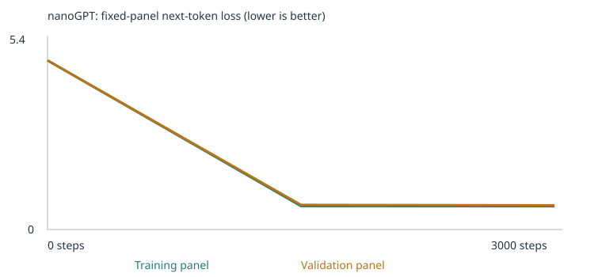
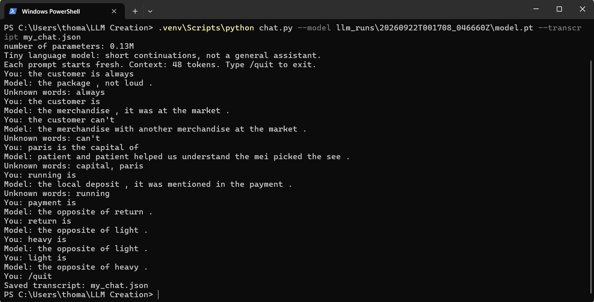

# My Custom LLM Experiment (Class 4)

## Overview

I trained the supplied tiny nanoGPT (2 layers, 4 heads, 64-number embeddings, 48-token context,
word-level tokens) on the classroom corpus, then on the classroom corpus plus two extension
files (opposites and negation), and ran the provided, unchanged 48-case eval suite
(`evals/language_evals.json`) before and after training in each experiment. This model
continues short sentences from a narrow corpus. It is not a general chat assistant.

Environment: Windows 11, CPU only, Python 3.12.10, PyTorch 2.14.0+cpu, run in a local `.venv`.

## Runs (nothing hidden)

| Run | Folder | What it was | Result |
|---|---|---|---|
| Failed attempt | `llm_runs/FAILED_numpy_missing_20260921T232740_042624Z` | First try; stopped before training because NumPy was missing from the environment | No model, no results |
| Setup check | `llm_runs/20260921T232818_017855Z` | 10 steps, lr 0.001, classroom corpus | Pipeline works; barely trained |
| **Starter** | `llm_runs/20260922T000008_123080Z` | 3000 steps, lr 0.001, classroom corpus only | Used below |
| Extension v1 (bug) | `llm_runs/20260922T001103_572234Z` | Same, plus extension files whose multi-sentence negation stories were split apart by the notebook | Kept for the record; see "What went wrong" |
| **Extension v2** | `llm_runs/20260922T001708_046660Z` | Same, plus fixed extension files | Used below |

Executed notebooks (outputs kept): `custom_llm_setup10.executed.ipynb`,
`custom_llm_starter.executed.ipynb`, `custom_llm_extension_v1.executed.ipynb`,
`custom_llm_extension_v2.executed.ipynb`. Each is the supplied `custom_llm.ipynb` with only
the settings cell differing for the 10-step run.

Environment fixes I made: git on Windows converted line endings to CRLF, which broke the
notebook's SHA-256 check of the eval suite; I restored the original bytes (they match the
pinned hashes and `git diff` against the instructor's commit is empty). NumPy had to be
installed because the notebook needs it and `requirements.txt` does not list it.

## My three choices

- **Corpus:** the classroom corpus first; then classroom plus `corpus/opposites.txt` and
  `corpus/negation.txt` (420 unique lines each; generator: `tools/make_extension_corpus.py`).
- **Training steps:** 10 for the setup check, then 3000 for both real experiments, so the
  corpus is the only difference between them.
- **Learning rate:** 0.001 (the notebook default, used with its warmup and cosine decay).

I ran a 10-step setup check first, to confirm the pipeline worked before spending time on a
real run. For both real experiments I used 3000 steps, so the only difference between them
is the corpus, not the training budget. I kept the learning rate at 0.001, the notebook's
default, since I had no reason to move it before seeing a baseline. An oversized learning
rate would overshoot the low point of the loss instead of settling into it, like taking huge
steps downhill and walking past the bottom of the valley; a rate that's too small barely
moves the weights and would need far more steps to get anywhere.

| | Starter | Extension v2 |
|---|---|---|
| Unique passages | 4,592 | 5,432 (+840 from my files) |
| Train / validation passages | 4,132 / 460 | 4,888 / 544 |
| Vocabulary (tokens incl. specials) | 136 | 423 |
| Unknown-token rate, train / held-out | 0.0 / 0.0 | 0.0 / 0.00032 |
| Parameters | 111,872 | 130,240 |
| Training time (CPU) | 18.3 s | 21.6 s |

Links: `llm_runs/<run>/corpus_manifest.json`, `vocabulary_report.json`, `split.json`. The split
is by passage (90/10), not by source file, so validation tests new sentences from the same
templates. My extension files are my own template-generated text, so there is no permission
issue and no PDF extraction to check.

## What I expected vs. what happened

Predictions written before each run: [prediction_starter.md](prediction_starter.md) (10-step
run), [prediction_3000.md](prediction_3000.md) (starter run) and
[prediction_extension.md](prediction_extension.md). Each has a dated "what actually happened"
section. Summary: I was right that 10 steps would barely move things and that extension cases
would be lowest; I was wrong that validation loss would stay flat after 10 steps, that new
phrasings would score lower after 3000 steps (they did not change in the starter run), and I
did not predict that the extension files would make only 1 of 24 extension cases scorable.

## Fixed eval suite results (48 cases, unchanged)

The eval scores whether the model gives the correct word the highest probability among four
choices. Ties score 0. Cases with words the model does not have are **unscorable and count as
0** in the all-case rate. Free continuations are saved separately and are not the score.

| Experiment | Stage | Correct / 48 | Scorable / 48 | Accuracy among scorable | Full results |
|---|---|---|---|---|---|
| Starter corpus | Untrained | 9 | 24 | 37.5% | `llm_runs/20260922T000008_123080Z/language_evals/untrained/` |
| Starter corpus | Trained (3000) | 20 | 24 | 83.3% | `llm_runs/20260922T000008_123080Z/language_evals/final/` |
| Expanded corpus (v2) | Untrained | 7 | 25 | 28.0% | `llm_runs/20260922T001708_046660Z/language_evals/untrained/` |
| Expanded corpus (v2) | Trained (3000) | 25 | 25 | 100% | `llm_runs/20260922T001708_046660Z/language_evals/final/` |

(Extension v1, for the record: untrained 6/48 with 25 scorable; trained 25/48 with 25 scorable,
identical scores to v2 on this eval.) Each folder has `eval_results.csv`, `eval_results.json`,
`eval_summary.json`, `eval_cases.json`. All 48 cases side by side:
[evidence/all_48_cases_comparison.csv](evidence/all_48_cases_comparison.csv).

By group, trained models:

| Group | Starter (3000) | Extension v2 (3000) |
|---|---|---|
| Starter patterns (16) | 16/16 | 16/16 |
| New phrasings (8) | 4/8 | 8/8 |
| Extension (24) | 0/24 (all unscorable) | 1/24 (23 unscorable) |
| Coverage (scorable / 48) | 0.500 | 0.521 |

### Four-choice score vs. free continuation vs. vocabulary coverage

- **Four-choice score:** the model is shown only the prompt and we look at the probability it
  gives each of four candidate words. Example: "the opposite of empty is" - the extension v2
  model ranked "full" highest among the four choices (score 1).
- **Free continuation:** the model generates text on its own with sampling. For that same
  prompt it wrote "clean ." So a model can pick the right option yet freely continue with
  something else; the two are different measurements. Another example, "the report about the
  customer explains the": four-choice pick "service" (correct), free continuation "support in
  detail ." in v2.
- **Vocabulary coverage:** whether every word in the prompt and all four choices is in the
  model's vocabulary. If not, the case is unscorable, however many steps we train. More
  training on the original corpus cannot supply missing words.

### What the results say, honestly

- **Starter patterns (16/16):** the eval prompts are not in the training text, but the corpus
  has many sibling sentences from the same templates, so this shows a narrow learned template,
  not language understanding.
- **New phrasings improved 4/8 -> 8/8 in the extension runs, but I do not know why.** Four
  cases flipped (lang_18, lang_19, lang_22, lang_23). My extension files were not aimed at
  them. Possible causes (all untested): a different vocabulary/initialization, more varied
  sentence shapes, or plain run-to-run noise. This is one seed and 8 cases; do not read it as
  a proven effect of the extension.
- **The extension did little on the eval:** 23 of 24 extension cases stayed unscorable because
  their prompts or answer choices contain words my files did not (for example colors, names,
  "warm", "noisy", "wide"). Only 1 opposites case became scorable, and it was correct. For
  negation, 0 of 3 became scorable. I looked at the list of missing words only **after**
  training, to explain the failures, and deliberately did not use it to write more teaching
  data (that would turn the eval into an answer list).
- **My own probe** (not the eval; `tools/negation_probe.py`, `evidence/probe_results.json`),
  on new word combinations unseen in training:

  | model (trained) | opposites | negation (word actually done beats negated word) |
  |---|---|---|
  | Extension v1 (bug) | 288/288 | 146/300 (49%, chance is 50%) |
  | Extension v2 (fixed) | 284/288 | 176/300 (59%) |

  The opposites result mostly shows the 23 word pairs were memorized in their templates.
  Negation is only modestly above chance after the fix, so the model has not learned negation
  in any general sense.
- **Development benchmark:** these 48 cases guided my choices, so this is a development
  benchmark and says nothing about unseen generalization.

### What went wrong (extension v1)

The notebook splits every corpus file at each ".", "!" or "?" into its own passage. My first
negation file wrote each story as separate sentences, so none of the 68 three-sentence stories
survived intact and the model never saw "did not X ... did Y ... Y" together. I found this by
checking how many source lines survived as one passage (615 of 840, and 0 of the 68 stories),
fixed the generator to join a story's sentences with commas (all 840 lines survive; 223 of
the 420 negation lines, 53%, have the final copy step; in v1 only 68 stories had it, and none
survived), and retrained as v2. v1 is kept, not deleted.
The fix did not change the 48-case scores (same 25/48) because the negation cases are
unscorable; it did change the probe (49% -> 59%). Because the eval writes stories with periods
and my files use commas, the model also has to generalize across punctuation.

## How eval material was kept out of training

- The eval suite lives in `evals/`, outside `corpus/`; `CORPUS_FOLDER` is `corpus`.
- The notebook withholds generated sentences containing reserved eval prefixes (160 passages)
  and rejects exact test prefixes in imported files: `eval_separation.json` in each run.
- My generator reads the eval file only to delete any generated line containing a whole eval
  prompt (0 were deleted). No eval prompt, and no prompt plus any of its four choices, appears
  in the saved `corpus.txt` of any run (setup, starter, extension v1, extension v2; checked by
  script).
- I wrote the extension files from the category ideas. Disclosure: I did see one negation
  prompt (lang_33) while diagnosing an overlap, and removed the template that caused it; two
  extension prompts share a generic 4-word phrase with my files (no 5-word overlap). After
  training I saw the words the model lacked (see above).
- These checks are exact-match text checks. They do not detect paraphrases or copied answer
  lists. Chat logs and `llm_runs/` are never placed in `corpus/`.

## Loss, samples and inspection evidence

Fixed panels of 20 training and 20 validation documents. Full data: `history.json`,
`training.csv`, `training_curves.svg` in each run folder. Losses between different corpora and
vocabularies are not directly comparable.

| Run | step | training loss | validation loss |
|---|---|---|---|
| Setup (10 steps) | 0 / 5 / 10 | 4.9263 / 4.3415 / 4.2076 | 4.9275 / 4.3228 / 4.2073 |
| Starter | 0 / 1500 / 3000 | 4.9263 / 0.6821 / 0.6783 | 4.9275 / 0.7182 / 0.7061 |
| Extension v2 | 0 / 1500 / 3000 | 6.0251 / 0.7629 / 0.7402 | 6.0399 / 0.8145 / 0.7545 |




Loss barely changed between step 1500 and 3000 in the starter run (validation 0.718 -> 0.706).
Samples (same start and settings; full files in each run's `samples/`): the starter model's
step-0 sample is word salad ("pear professor bond doctor course harvest team ..."), and by step
1500 and 3000 it writes "our school has a question about the new educator and lesson ." (a
corpus-style sentence; the same at both steps). Extension v2 step 0 is also word salad; at step
3000 it writes "the report about the shopper explains the purchase in detail ."

Token "customer" (starter run, `inspection.json`, `tokenization.json`): token ID 28. In the
3000-step starter run its first embedding coordinate started at -0.05759 with gradient
+0.000693 and moved by 0.00001 in the first update, because the learning rate is still warming
up (1e-05 at step 1). In the 10-step run the warmup is one step, so the same coordinate moved
by about 0.001 (from -0.05759 to -0.05859). After "the customer" the untrained model was
close to a shrug over its 136 words (the largest single probability was 0.016; uniform would
be 1/136 = 0.0074); after 3000 steps the top next words were "reviewed" (0.178),
"recommended" (0.171), "ordered" (0.169), "selected" (0.163).

Temperature comparison (`temperature_comparison.json`, samples at 0.3, 0.8, 1.2, no retraining):
the first sample is identical at all three temperatures in both models; later samples differ
in places, for example the starter's second sample ends "different investment" at 0.3 and
"different deposit" at 0.8. Only sampling changed; no weights changed.

### Explanations (in my own words)

Full version with the loss/gradient/weight-change walkthrough: [my_explanations.md](my_explanations.md).

**Token, token ID, and embedding.** The fact that token IDs are adjacent to one another does
not mean that the words are similar. Two similar words would point in similar directions via
the embedding process. "customer" is token ID 28 in the starter run; a word with ID 29 could
be completely unrelated in meaning. The ID is just a slot number, not a measure of similarity;
the 64-number embedding is where similarity actually lives, and it's what training adjusts.

**Loss, gradient, and weight change.** Loss is how surprised the model is by the real next
word. The gradient says, for each weight, which way the loss changes if you nudge it — a
positive gradient means nudging up increases surprise, so the weight moves down instead, by
roughly the learning rate. In the run, the first coordinate of the "customer" embedding had
gradient +0.000693 and moved from -0.05759 to -0.05859 (learning rate 0.001) in the 10-step
run. Repeating this for every weight, every step, is what makes the probability on words that
really follow "the customer" go up and the loss go down (4.93 -> 0.68 over 3000 steps in the
starter run).

**Probabilities becoming a generated word, and temperature.** The model doesn't always output
the top-probability word; instead it generates samples where a word with 30% probability is
picked 30% of the time. Temperature shapes the lottery before drawing: high and low
temperatures mean the text will be more and less predictable. This only changes how a word is
picked at generation time; it does not change any weights (see the temperature comparison
above, where the same trained model gives different samples at 0.3, 0.8, and 1.2).

**Why attention cannot see future tokens.** Allowing the model to peek at the word it is
trying to guess would defeat the purpose. It would have learned nothing from training, and the
prediction wouldn't actually be a prediction. Blocking future tokens during training keeps
training consistent and relevant to how the model is actually used afterward, when future
words genuinely don't exist yet.

## Chat interface

Terminal interface: `chat.py`. It loads `model.pt` and its saved vocabulary, and each prompt
starts fresh (no memory). It is a tiny language model that continues text, not an assistant.
Context is 48 tokens; unknown words are reported and mapped to `<UNK>`. Replying does not
retrain the model or touch the corpus.

```bash
.venv/Scripts/python chat.py --model llm_runs/20260922T001708_046660Z/model.pt --transcript my_chat.json
```

Model used: extension v2, `model.pt` SHA-256 (as recorded in the transcript)
`59def98822174877d28fc0a3a45e11287b1be41df2a534a686fb7c8093f2645e`, 3000 steps. This is my own
session, typed and run by me: transcript
[evidence/chat_transcript_my_own.json](evidence/chat_transcript_my_own.json), screenshot
[evidence/chat_screenshot_my_own.png](evidence/chat_screenshot_my_own.png).



| Prompt | Model reply | Note |
|---|---|---|
| the customer is always | the package , not loud . | Unknown word: "always" |
| the customer is | the merchandise , it was at the market . | Corpus-style completion |
| the customer can't | the merchandise with another merchandise at the market . | Unknown word: "can't"; the contraction is dropped and the model just continues as if it weren't there |
| paris is the capital of | patient and patient helped us understand the mei picked the see . | Unknown words: "capital", "paris" — with two of the four prompt words unknown, the reply is closer to noise |
| running is | the local deposit , it was mentioned in the payment . | Unknown word: "running"; falls back to a generic corpus-style sentence |
| payment is | the opposite of return . | **Invented pairing.** "payment" and "return" never appear near the word "opposite" anywhere in training (checked: 137 total uses of "opposite" in the training text, none involving these two words). The model learned the sentence shape "___ is the opposite of ___ ." and applies it to any noun, whether or not it was ever taught as having an opposite |
| return is | the opposite of light . | Same invented-pairing behavior as above |
| heavy is | the opposite of light . | **Memorized.** "heavy is the opposite of light ." is a literal line in the training corpus |
| light is | the opposite of heavy . | **Generalized, not memorized.** This exact sentence does not appear in training (only the "heavy is..." direction does) — the model produced the reverse direction correctly for a pair it was actually taught, without being shown that direction |

Each reply is one random sample at temperature 0.8, so any single reply is a weak signal on
its own; the probe in the eval section above measures the tendency across 300 items. The main
limitations visible here: it cannot handle contractions or answer factual questions, unknown
words are silently ignored rather than causing an error, and it will confidently apply the
"opposite of" sentence pattern to words that were never taught as having an opposite —
learning a syntax template is not the same as learning which words the template actually
applies to.

## Rerun the evals and the chat

```bash
python -m venv .venv
.venv/Scripts/python -m pip install "torch>=2.2,<3" "pypdf>=5,<7" numpy jupyter
.venv/Scripts/python run_evals.py --model llm_runs/20260922T001708_046660Z/model.pt --output results/my-evals
```

The rerun of extension v2 gave results identical to the notebook (same model hash, identical
per-case CSV): `evidence/rerun_extension_v2_final/`. To rerun a notebook: open it in Jupyter
or VS Code with that environment and Run All (each run creates a new `llm_runs/` folder and ZIP).

## One limitation and my next experiment

Observed limitation: 23 of 24 extension cases were unscorable because of missing words, and
the negation "copy" behavior is only 59% on my probe.

One limitation I saw directly in my own chat session: the model will confidently apply the
"___ is the opposite of ___ ." sentence pattern to any noun, even ones never taught as having
an opposite (it said "payment is the opposite of return," a pairing that appears nowhere in
training). For my next experiment, I would add a few "X has no opposite" style teaching
examples, to see whether that curbs the over-application, and I would compare the model's
saved probability on its top answer for invented pairs versus real trained pairs. I'd predict
the invented-pair probabilities are lower even when the model still picks a word, since it's
applying a pattern rather than a fact it actually knows — and if that gap is small or absent,
it would show the model can't tell the difference at all, which would be worth reporting
honestly.

Also worth trying: repeat each run with a second seed to see whether the new-phrasing jump
(4/8 -> 8/8) is real, and write more negation stories with the copy step and more varied
vocabulary before a longer training run.

## Publishing notes

`.gitignore` was updated to track `corpus/opposites.txt`, `corpus/negation.txt`, and the
`llm_runs/` run folders this README links to (the redundant per-run `.zip` archives are still
excluded, since each folder's contents are already tracked individually and the ZIP just
duplicates them; keep a ZIP locally per the assignment's "save the results ZIP" instruction).
The repository was pushed to my own public GitHub account, replacing the instructor's `origin`
remote used only to fetch the starter files.

Before final submission: open the repository signed out and confirm the notebook outputs,
plot, and every linked file actually load, then submit the repository URL through the course
portal in bcourses myself.
